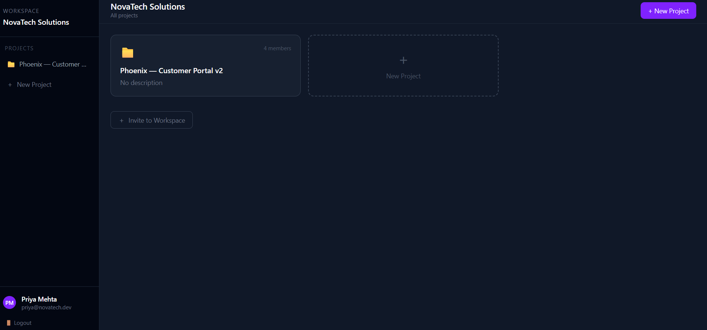
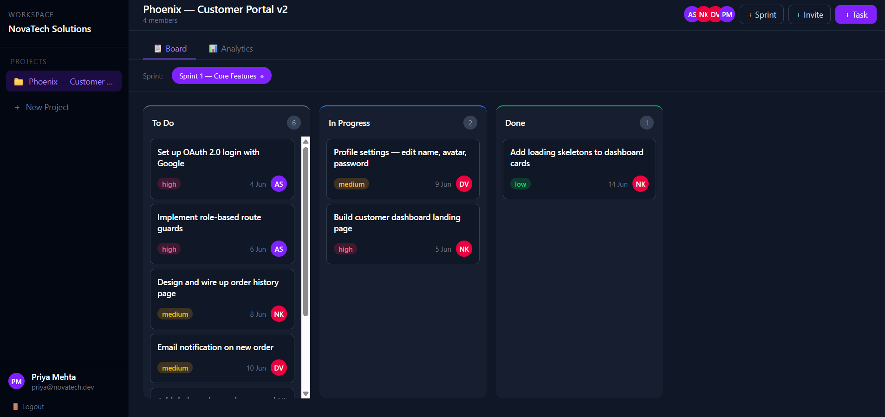
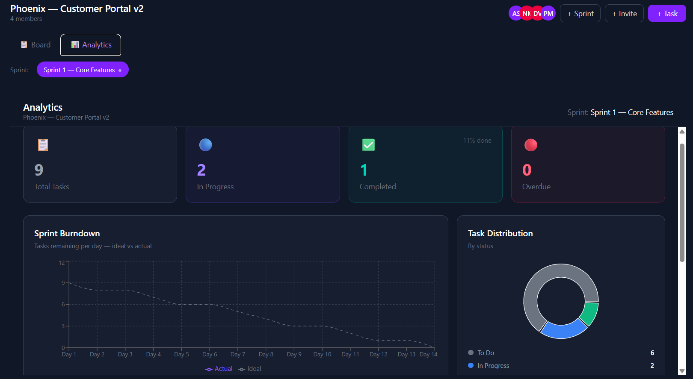
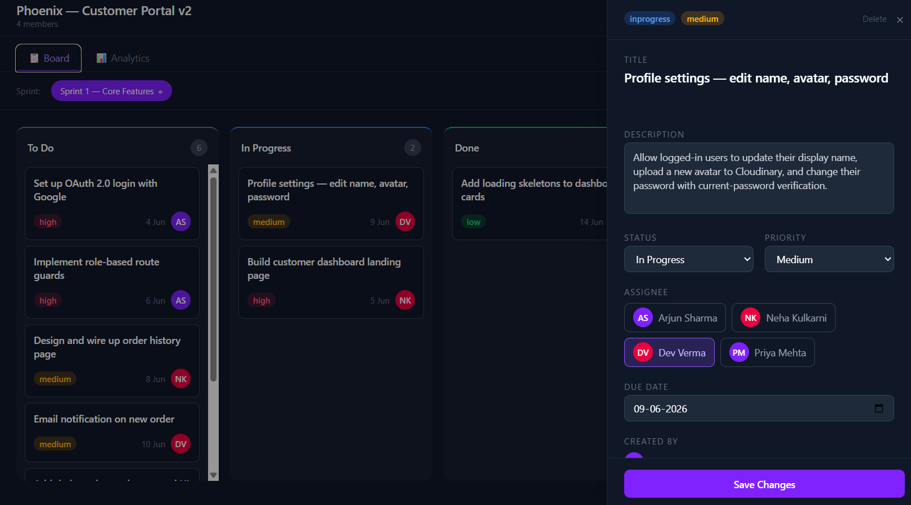

# DevBoard — Real-Time Project Management Platform

A full-stack project management tool built with the MERN stack. Think Jira + Trello, 
built from scratch with real-time collaboration, role-based access control, and a 
full CI/CD pipeline.

**Live Demo:** [devboard-khaki.vercel.app](https://devboard-khaki.vercel.app)

## Screenshots

<!-- Add screenshots after taking them -->





## Features

- **Authentication** — JWT with HTTP-only cookies, Remember Me (7d/30d)
- **Workspaces & Projects** — Multi-tenant with role-based access (Manager/Member/Viewer)  
- **Kanban Board** — Drag and drop with real-time sync across all users
- **Real-Time** — Socket.io — move a card, teammates see it instantly
- **Sprint Management** — Plan sprints, track velocity, burndown charts
- **Analytics Dashboard** — Task distribution, member workload, activity feed
- **CI/CD** — GitHub Actions runs tests on every PR, auto-deploys on merge

## Tech Stack

| Layer | Technology |
|---|---|
| Frontend | React.js, TailwindCSS, Zustand, React Query |
| Backend | Node.js, Express.js |
| Database | MongoDB + Mongoose |
| Real-time | Socket.io |
| Auth | JWT + HTTP-only Cookies + RBAC |
| DevOps | Docker, GitHub Actions CI/CD |
| Deploy | Vercel (frontend) + Render (backend) + MongoDB Atlas |

## Local Setup

### Prerequisites
- Node.js 20+
- Docker Desktop

### Run locally

```bash
# Clone the repo
git clone https://github.com/joeljoymon/devboard.git
cd devboard

# Start MongoDB with Docker
docker compose up -d mongo

# Install and run server
cd server
cp .env.example .env   # fill in your values
npm install
npm run dev

# Install and run client (new terminal)
cd client
npm install
npm run dev
```

App runs at `http://localhost:5173`

### Environment Variables

**server/.env**
```
MONGO_URI=mongodb://localhost:27017/devboard
PORT=5000
JWT_SECRET=your-secret-key
CLIENT_URL=http://localhost:5173
NODE_ENV=development
```

**client/.env**
```
VITE_API_URL=http://localhost:5000
```

## Running Tests

```bash
cd server
npm test
```

## Architecture

```
devboard/
├── client/          # React frontend (Vite)
│   ├── src/
│   │   ├── components/    # Reusable UI
│   │   ├── pages/         # Route pages
│   │   ├── store/         # Zustand stores
│   │   ├── hooks/         # Custom hooks
│   │   └── socket/        # Socket.io client
│
├── server/          # Express backend
│   ├── src/
│   │   ├── models/        # Mongoose schemas
│   │   ├── routes/        # Express routes
│   │   ├── controllers/   # Business logic
│   │   ├── middleware/     # Auth + RBAC
│   │   └── socket/        # Socket.io server
│
└── .github/
    └── workflows/   # CI/CD pipeline
```

## API Endpoints

| Method | Endpoint | Auth | Description |
|---|---|---|---|
| POST | /api/auth/register | ❌ | Register user |
| POST | /api/auth/login | ❌ | Login |
| GET | /api/auth/me | ✅ | Current user |
| POST | /api/workspaces | ✅ | Create workspace |
| GET | /api/workspaces/me | ✅ | My workspace |
| POST | /api/projects | ✅ | Create project |
| GET | /api/projects | ✅ | List projects |
| POST | /api/sprints | ✅ | Create sprint |
| POST | /api/tasks | ✅ | Create task |
| PATCH | /api/tasks/reorder | ✅ | Drag and drop |

## Author

**Joel Joymon** — CS Engineering Graduate 2026  
[LinkedIn](https://linkedin.com/in/joeljoymon) · [GitHub](https://github.com/joeljoymon)